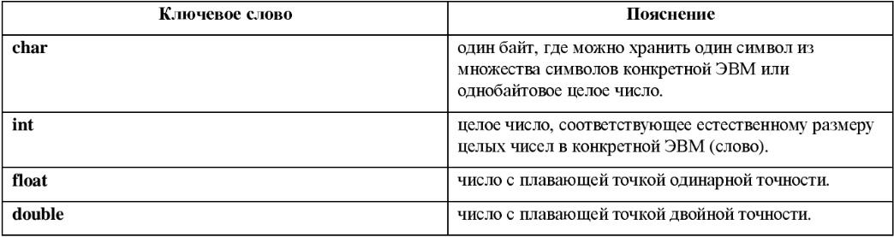
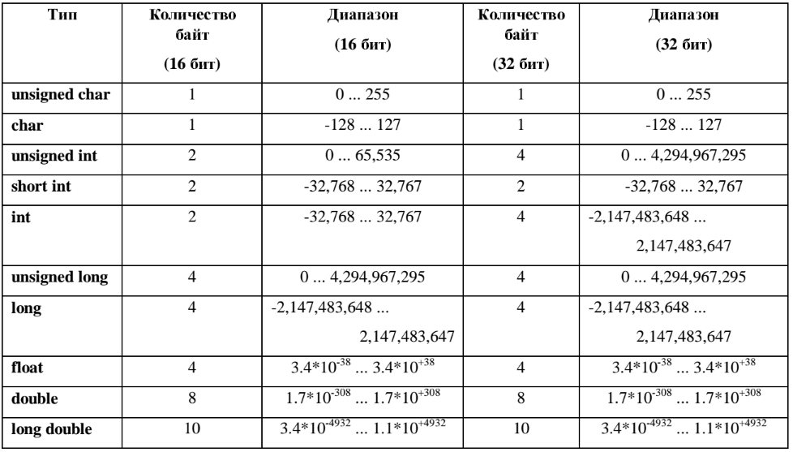

# Лекция 1

Темы, которые будут рассмотрены на этой лекции:
- Функция вывода на экран. Делаем Hello World;
- Основные типы данных: int, float, char. Переменные;
- Базовые алгоритмические конструкции: if, if-else, for, while, do-while, switch.

## Hello world!

Изучение любого нового языка программирования принято начинать с программы, выводящей на экран сообщение "Hello World!". Давайте же и напишем ее!

Для этого нам понадобится функция *printf*, описанная в заголовочном файле stdio.h (заголовочные файлы подробнее будут рассмотрены во второй лекции):

```C
// - так обозначается комментарии в Си
/* И вот так */
#include <stdio.h> // директива #include включает в нашу программу объявления функций из заголовочного файла stdio.h  

int main()        // Начало модуля main - основной программы.
{
  printf("Hello World!\n"); //Все, что нужно вывести на экран, заключается в двойные кавычки.
}
```
Обратите внимание на символы *\n*. Это т.н. эскейп-последовательность (также *управляющиая последовательность* — последовательность из двух символов, обозначающих один), которая говорит, что после ее считывания продолжить печатать нужно с новой строки. Вот список всех ескейп-последовательностей:

|Последовательность| Значение|
| - |:-------------:|
|\a |	подача звукового сигнала|
|\b | возврат назад и затирание|
|\f | прогон страницы|
|\n | конец строки|
|\r | возврат каретки|
|\t | горизонтальная табуляция|
|\v | вертикальная табуляция|
|\ooo| восьмеричное число|
|\xhh| шестнадцатеричное число|
|\\ | обратная косая черта|
|\? | вопросительный знак|
|\' | одинарная ковычка|
|\" | двойная кавычка|

**Замечание:** последние четыре последовательности это так называемые *экранированные* символы. Т.е. мы ставим обратный слеш дважды, чтобы показать, что намерены использовать именно этот символ, а не какую-то специальную последовательность, начинающуюся с него, как бы *экранируя* его.

**Замечание 2:** В ОС семейства Windows для перевода строки используется последовательность символов **\r\n**, в то время как в Linux — просто **\n**.

В конце каждой строчки ставится оператор ";", если эта строчка не начинается с директивы препроцессора типа #include.
После компиляции на выходе мы получаем следующее:


Hello World!


Чего мы и хотели.

### Форматный вывод в printf
Функция printf() может выводить не только строчки, но и значения различных констант и переменных. Для этого используются спецификаторы формата. Пример спецификатора: "%d".  На месте этого спецификатора ставится целое число, которое берется из аргументов функции printf.
Для понятности рассмотрим общий вид функции printf:
```C
int printf(const char *format, arg-list);
// const char *format - строка символов, которую нужно вывести на экран. Также содержит спецификаторы формата
// arg-list - список аргументов (переменные, константы), которые нуждаются в выводе
```
На месте спецификаторов появляются значения аргументов из списка arg-list.

Количество аргументов должно точно соответствовать количеству спецификаторов формата, причем следовать они должны в одинаковом порядке. Например, следующий вызов функции printf():

```C
  printf ("Hi %с %d %s", 'с', 10, "there!");
```

Приведет к выводу «Hi с 10 there!».
Строка символов, выводимая на экран, отделяется от аргументов запятой. Аргументы друг от друга также отделяются запятой.

###### Таблица команд форматирования функции printf
|Код| Формат|
| - |:-------------:|
|%с |	Символ типа char|
|%d |	Десятичное число целого типа со знаком||
|%i |	Десятичное число целого типа со знаком|
|%е |	Научная нотация (е нижнего регистра)|
|%Е |	Научная нотация (Е верхнего регистра)|
|%f |	Десятичное число с плавающей точкой|
|%g |	Использует код %е или %f — тот из них, который короче (при использовании %g используется е нижнего регистра)|
|%G |	Использует код %Е или %f — тот из них, который короче (при использовании %G используется Е верхнего регистра)|
|%о |	Восьмеричное целое число без знака|
|%s |	Строка символов|
|%u |	Десятичное число целого типа без знака|
|%х |	Шестнадцатиричное целое число без знака (буквы нижнего регистра)|
|%Х | Шестнадцатиричное целое число без знака (буквы верхнего регистра)|
|%р |	Выводит на экран значение указателя|
|%n |	Ассоциированный аргумент — это указатель на переменную целого типа, в которую помещено количество символов, записанных на данный момент|
|%%	| Выводит символ %|

Кроме того, могут быть применнеы модификаторы типов, например:
%ld — long int,
%hu — short unsigned,
%lf — long double.

## Типы данных и переменные

### Переменная в Си

Любая переменная в Си характеризуется своим именем и типом данных, которые в ней хранятся.

#### Имя переменной

Имена (идентификаторы) переменных в языке С составляются из букв и цифр, причем первый символ должен быть буквой. Символ подчеркивания " _ " считается буквой. Прописные и строчные буквы различаются. В качестве имен переменных запрещается использовать ключевые слова языка программирования С.

#### Тип данных

Тип данных - это логическая, или человеческая интерпретация значений байтов, которые занимает переменная. По сути, механизм типа данных в различных языках программирования вводится, чтобы связать значения битов\байтов\слов в памяти ЭВМ с понятному каждому человеку словами "целое число", "вещественное число", "символ" и пр., с которыми компьютер не оперирует.

Простые типы данных в Си:



У каждого типа данных в Си есть две величины, которые его характеризуют:
- количество байт, отводимых под переменную данного типа;
- диапазон возможных значений.

В языке С для целых чисел введены следующие три модификатора:
- short;
- long;
- unsigned.

Модификаторы short и long связаны с размером целых чисел.

Модификатор unsigned позволяет интерпретировать содержимое соответствующих ячеек памяти как целое число без знака. Числа без знака всегда положительны.

Пример размеров и диапазонов величин данных простых типов:



**Замечание:** данная таблица не является стандартом, а лишь примером. Размер типа данных может зависеть как от компилятора, так и от разрядности архитектуры компьютера.
**UPD:** char всегда занимает один байт, short — не менее 16 бит, long — не менее 32 бит, и при этом размер short не превосходит размера int, а размер int не превосходит размер long. Схожая картина для float, double и long double: float не превосходит double, а double не превосходит float. Таким образом, из трех этих размеров различными могут быть один, два или все три.

Чтобы точно узнать количество байт, отводимых под конкретный тип данных, можно воспользоваться функцией *sizeof*. Например:
```C
  printf("%d\n",sizeof(int));  //Выводим на экран количество байт, отводимых под тип данных int.
```
### Целый тип данных
Собственно, название типа данных говорит само за себя. Переменная данного типа хранит в себе целые числа. 

Перед использованием переменной необходимо ее объявить. Объявление в программе выглядит так:

```C
int i;        //Переменная i имеет тип данных int.
int i=0;      //Возможна инициализация переменной при ее объявлении.
int i=0x199A; //Также возможно оперирование с целыми числами в шестнадцатеричном формате (до числа ставится 0x или 0X);
int i=0177;   //и в восьмеричном формате (перед числом ставится 0).
```

#### Операции с переменными целого типа

Простое присваиваивание:
```C
i=0; //Переменная i получит значение 0
```
Арифметические операции:
```C
i=i+5; //Увеличение i на 5
i+=5;  //Аналогичная операция с укороченной записью. Общий вид - i*=x, где * - знак операции, i - переменная, x - переменная либо число
i=i%j  //Остаток от деления i на j
i%=j   //Операция, аналогичная i=i%j.
i=i*j;
i*=j;
printf("i+j = %d", i+j); //Выражения можно использовать внутри функций...
printf("i+j = %d", i=i+j); //и даже присваивание можно использовать внутри функций. Итоговое значение запишется в i и будет выведено на экран.
```


Также в Си есть операции инкремента и декремента.

Инкремент " ++ " – это увеличение значения переменной на единицу. Декремент " -- " – это уменьшение на единицу. Операции декремента и инкремента с лёгкостью заменяются арифметическими операциями или операциями присваивания. Но использовать операции инкремента и декремента намного удобнее.
```C
int i;
//синтаксис операций инкремента и декремента
++i;  // префиксный инкремент (преинкремент)
i++; // постфиксный инкремент (постинкремент)
--i;  // префиксный декремент (предекремент)
i--; // постфиксный декремент (постдекремент)
```
При использовании операции преинкремента значение переменной сначала увеличивается на 1, а затем используется в выражении. При использовании операции постинкремента значение переменной сначала используется в выражении, а потом увеличивается на 1.

Аналогично и для декремента.
```C
  int i=5;
  printf("i   = %d \n",i);    //Вывод: i = 5
  printf("i++ = %d \n",i++);  //Вывод: i = 5
  printf("i   = %d \n",i);    //Вывод: i = 6
  i=5;
  printf("++i = %d \n",++i);  //Вывод: i = 6

  int a,b;  
  b = 1;
  a = b++; // a == 1, b == 2.
  a = ++b; // a == 3, b == 3.

```
Побитовые операции

В языке программирования С имеются шесть операций для манипулирования с битами. Их можно применять только к целочисленным операндам, т.е. к операндам типов char, short, int и long, знаковым и беззнаковым:

|Знак|Операция    |
| -  |:----------:|
| &  | побитовое И|
| \|  | побитовое ИЛИ|
| ^  | побитовое исключающее ИЛИ|
| << | сдвиг влево|
| >> | сдвиг вправо|
| ~  | побитовое отрицание|

Операция & (побитовое И) часто используется для обнуления (сброса) некоторой группы разрядов.
Пример:
```C
n = n & 0x000F;
```

Операция | (побитовое ИЛИ) применяется для установки определенных разрядов в 1.
Пример:
```C
x = n | 0x0101;
```

Операция ^ (побитовое исключающее ИЛИ) в каждом разряде устанавливает 1, если соответствующие разряды операндов имеют различные значения, и 0 в противном случае.
Пример:
```C
y = x ^ 0x1010;
```

Операция << выполняет сдвиг влево своего левого операнда на число битовых позиций, задаваемое правым операндом, которое должно быть положительным.
Пример:
```C
y = y << 2;
```
Операция >> выполняет сдвиг вправо своего левого операнда на число битовых позиций, задаваемое правым операндом, которое должно быть положительным. Сдвиг вправо беззнаковой величины всегда сопровождается заполнением освобождающихся разрядов нулями. Сдвиг вправо знаковой величины в одних системах программирования С происходит с размножением знака ("арифметический сдвиг"), на других — с заполнением освобождающихся разрядов нулями ("логический сдвиг").
Пример:
```C
y = y >> 2;
```

Унарная операция ~ (побитовое отрицание) превращает единичные биты в нулевые и наоборот (дополнениецелого до единиц по всем разрядам).
Пример:
```C
x = ~y;
```

### Вещественный тип данных
Данный тип данных позволяет оперировать с вещественными числами.

Объявление:
```C
float f=1.0;
double g;
```

Возможные операции:
```C
f=f+1320;   //сложение
f=f+1320.0; //то же самое сложение
f+=1320.0;  //еще немного сложения
f=f*1320;   //умножение
f=f/1320;   //деление
f++;        //инкремент также можно использовать.
printf("f = %f", f); //вывод на экран

```
Все просто.

### Символьная константа
Символьная (литерная) константа есть целое число, записанное в виде литеры, обрамленной одиночными кавычками. Значением литерной константы является числовой код литеры из набора литер на конкретной ЭВМ. Литерные константы могут участвовать в операциях над числами точно так же, как и любые другие целые, хотя чаще они используются для сравнения с другими литерами. Некоторые литеры в литерных и строковых константах записываются с помощью эскейп-последовательностеи, которая представляется в виде \L, где L может быть:
- буквой;
- числом из одной, двух или трех восьмеричных цифр, определяющих код символа;
- числом из одной, двух или трех шестнадцатиричных цифр с предшествующей буквой x или X, определяющих код символа.

Примеры:
```C
'А', 'Д', 'g';
'\n' — символ новой строки;
'\\' — обратная дробная черта;
'\'' — апостроф;
'\47' — апостроф;
'\x27' — апостроф;
'\"' — двойная кавычка.
```

Объявление в программе переменных-символов:
```C
char c='a';
```
Примеры работы с символами:
```C
char c='a';
printf("symbol a   = %c \n",a);        //Можно вывести как символ, заключенный в переменной,
printf("number of symbol = %d \n",a);  //так и его номер в таблице кодирования.
printf("symbol a+1 = %c",a+1);         //И даже символ, следующий за 'а'. Это 'b'.

```
### Символьная строка

Строковые константы — это нуль или более литер, заключенные в двойные кавычки.
Пример:
```C
"The Beatles\n"
```
**Замечание.** Фактически строковая константа представляет собой тип данных "массив символов". Массивы будут рассмотрены подробнее в лекции 2, пока что ограничимся только знанием, что такая вещь существует.

## Алгоритмические конструкции
С помощью конструкций управления можно изменять порядок выполнения команд в программе. К таким конструкциям относятся:
- if-else
- for
- while
- do-while
- switch

### Блоки операторов

Фигурные скобки *{* и *}* используются для объединения описаний и операторов в составной оператор или блок, чтобы с точки зрения синтаксиса эта новая конструкция воспринималась как один оператор. После правой закрывающей фигурной скобки в конце блока точка с запятой не ставится.

Пример.
```C
{
  int j, k;
  j= 123;
  k = j * 23;
}
```
### Конструкции if-else, else-if
Конструкция *if-else* используется для принятия решения. Эта конструкция имеет следующий синтаксис:

```C
if (выражение)
      оператор1
[ else
      оператор2 ]   // []  - блок может отсутствовать
```
*Выражение* является истинным, если значения выражения не равняется нулю. *Выражение* является ложным, если оно равняется нулю.

*Оператор1* выполняется, если выражение в скобках после if истинно (не равняется нулю).

*else-часть* выполняется, если выражение в скобках после if ложно (равняется нулю).

Отсутствие в одной из вложенных друг в друга if-конструкций else-части может привести к неоднозначному толкованию записи. Эта не однозначность разрешается тем, что else связывается с ближайшим if, у которого нет своего else.
Пример:
```c
if (n>0)
  if (a<b)
    z = a;
  else
    z = b;
```
При необходимости иной интерпретации требуется должным образом использовать блок операторов.
Пример:
```C
if (n>0) {
  if (a<b)
    z = a;
} else
  z = b;
```
#### Операции отношения и логические операции
В условных операторах также присутствует возможность сравнивать различные значения (например, переменных).
Примеры:
```C
  int i,j;
  i == j; //сравнение на равенство.  Истинно, если равны i и j
  i != j; //сравнение на неравенство
  i >  j; //i > j
  i <  j: //i < j
```

А также логические операции && (логическое умножение), || (логическое сложение) и ! (логическое отрицание):
```C
int i,j;
<<<<<<< HEAD:Lecture 1/lecture_1.md
if(i==6 && j==9) {
  printf("Success!\n"); //выведется, если i=6 и j=6
=======
if(i==6 && j==9)
{
  printf("Success!\n"); //выведется, если i=6 и j=9
>>>>>>> 568003e184cf775289262d25352b144eea14cf4b:Lecture 1/31-03-2017.md
}

//////////////////////////////////////////////////////////////////

<<<<<<< HEAD:Lecture 1/lecture_1.md
if(!i || j) {
  printf("Success x2! \n"); //выведется, если i = 0 или j !=0)
=======
if(!i || j){
  printf("Success x2! \n"); //выведется, если i = 0 или j !=0.
>>>>>>> 568003e184cf775289262d25352b144eea14cf4b:Lecture 1/31-03-2017.md
}

if(i) {
  printf("Success x3! \n"); //выведется, если i != 0.
}

<<<<<<< HEAD:Lecture 1/lecture_1.md
if(1) {
  printf("Flawless victory. \n"); //выведется в любом случае, т.к. 1 != 0
=======
if(1)
{
  printf("Flawless victory. \n"); //выведется в любом случае, так как 1 != 0 в любом случае.
>>>>>>> 568003e184cf775289262d25352b144eea14cf4b:Lecture 1/31-03-2017.md
}
```

#### Конструкция else-if
Конструкция else-if представляет собой наиболее общий способ описания многоступенчатого принятия решения.Синтаксис конструкции:
```
if (выражение1)
  оператор1
else if (выражение2)
  оператор2
else if (выражение3)
  оператор3
.........
[else
  операторN]
```

Выражения вычисляются по порядку; как только встречается выражение со значением "истина", выполняется соответствующий ему оператор; на этом последовательность проверок завершается.Последняя else-часть выполняется, если все предыдущие условия не выполняются. Пример:
```C
//Определение типа символа (цифра - 1, пробел - 2, другойсимвол - 3)
if ( (c == '0') || (c == '1') || (c == '2') || (c == '3') || (c == '4') ||      
   (c == '5') || (c == '6') || (c == '7') || (c == '8') || (c == '9') ) {
   ntype = 1;
} else if (c == ' ') {
  ntype = 2;
} else {
  ntype = 3;
}
```
### Конструкция switch(переключатель)
Конструкция switch используется для выбора одного из многих путей выполнения программы в зависимости от значения выражения, результат которого должен быть целым или символом.

Синтаксис:

```C
switch (выражение) {
  case константа1: [операторы1]
  case константа2: [операторы2]
  ..............
  case константаN: [операторыN]
  [default: операторы]
}
```
Конструкция switch проверяет, совпадает ли значение выражения с одним из значений, входящих в некоторое множество целых констант, и выполняет соответствующие этому значению операторы.

Каждая ветвь case помечена одной или несколькими целочисленными константами или константными выражениями.

Вычисления начинаются с той ветви case, в которой константа совпадает со значением выражения.

Константы всех ветвей case должны отличаться друг от друга. Если ни одна из констант не подходит, то выполняется ветвь, помеченная словом default, если таковая имеется, в противном случае ничего не делается. Ветви case и default можно располагать в любом порядке. Пример:
```C
<<<<<<< HEAD:Lecture 1/lecture_1.md
//Определение типа символа (цифра - 1, пробел - 2, другойсимвол - 3)
switch (c) {
  case '0':
  case '1':
  case '2':
  case '3':
  case '4':
  case '5':
  case '6':
  case '7':
  case '8':
  case '9':
    ntype = 1;
    break;
  case ' ':
    ntype = 2;
    break;
  default:
    ntype = 3;
    break;
=======
//Определение типа символа (цифра - 1, пробел - 2, другой символ - 3)
switch (c) 
{
case '0': case '1': case '2': case '3': case '4': case '5': case '6':
case '7':
case '8':
case '9': 
  ntype = 1;
  break;
case ' ': 
  ntype = 2;
  break;
default: 
  ntype = 3;
  break;
>>>>>>> 568003e184cf775289262d25352b144eea14cf4b:Lecture 1/31-03-2017.md
}
```
Оператор break вызывает немедленный выход из конструкции switch. Поскольку выбор ветви case реализуется как переход на метку, то после выполнения одной ветви case, если ничего не предпринять, программа будет выполнять следующую ветвь case. Инструкции break и return являются наиболее распространенными средствами выхода из конструкции switch.

### Конструкции цикла

#### Цикл с предусловием (while)

Синтаксис конструкции цикла с предусловием:
```C
while(выражение)
  оператор
```
Сначала вычисляется *выражение*. Если его значение истинно (не равно 0), то выполняется оператор, и вычисление выражения повторяется/ Этот цикл повторяется до тех пор, пока выражение не станет ложно (равно 0), после чего управление передается на следующий за конструкцией цикла оператор.

Пример:
```C
i = 2;
s = 1.0;

while (i <= 5) {
  s *= a;
  i++;
}
```

#### Цикл с постусловием ( do-while )

Синтаксис конструкции цикла с постусловием:
```C
do
  оператор
while (выражение);
```
Тело цикла с постусловием выполняется хотя бы один раз. Сначала выполняется оператор, затем вычисляется выражение. Если выражение истинно, то оператор выполняется снова. Когда выражение становится ложным, цикл заканчивает работу.

Пример:
```C
s = 1.0;
i = 1;

do {
  s *= a;
  i++;
} while (i<5);
```
#### Цикл с параметром ( for )

Синтаксис конструкции цикла с параметром:
```C
for ([выражение1]; [выражение2]; [выражение3])
  оператор
```
Данная конструкция аналогична следующей конструкции:
```C
выражение1;
while (выражение2) {
  оператор;
  выражение3;
}
```
С точки зрения грамматики языка программирования С *выражение1*, *выражение2*, *выражение3* представляют собой произвольные выражения, но чаще *выражение1* и *выражение2* — это присваивания или вызовы функций, а *выражение3* — выражение отношения. Любое из трех выражений может отсутствовать, но точку с запятой опускать нельзя. При отсутствии *выражения1* или *выражения3* считается, что их просто нет в конструкции цикла; при отсутствии *выражения2* полагается, что его значение как бы всегда истинно.

Пример:
```C
int i;
float s;

for (i = 1, s = 1.0; i<=5; i++) {
  s *= a;
}
```
#### Операторы break и continue

Оператор break позволяет немедленно выйти из цикла или переключателя. Этот оператор вызывает немедленный выход из самого внутреннего из объемлющих его циклов или переключателей.

Пример:
```C
i = 1;
s = 1.0;

for (;;) {
  if ( i > 5) {
    break;
  }
  s *= a;
  i++;
}
```
Оператор continue вынуждает объемлющий его цикл ( for, while, do-while ) начать следующий шаг итерации. Для циклов while и do-while это означает немедленный переход к проверке условия, а для цикла for — к приращению шага. Оператор continue можно применять только к циклам, но не к конструкции switch. Будучи помещенным внутрь конструкции switch, расположенной в цикле, этот оператор вызовет переход к следующей итерации этого цикла.

Пример:
```C
for (i=0; i<n; i++) {
  if (a[i]<0)
  {
    continue;
  }
  ..........................
}
```
#### Оператор перехода goto и метки

Синтаксис оператора goto:
```C
goto метка;
```
Оператор goto осуществляет передачу управления на оператор помеченный меткой. Метка должна быть расположена в текущей функции. Нельзя передавать управление во внутренний блок. Наиболее типичная ситуация для применения оператора перехода — необходимость прервать обработку в некоторой глубоко вложенной структуре и выйти сразу из двух или большего числа вложенных циклов.

Метка может стоять перед любым оператором:
*идентификатор: оператор*

Пример:
```C
for (...) {
  for (...) {
    if (...)
      goto met;
  }
}
.......
met: ........
```

## Шпаргалка по всем операциям в C
### Унарные операции
|Обозначение|Операция    |
| -         |:----------:|
| & | получение адреса |
| * | обращение по адресу |
| - | унарный минус |
| ~ | побитовая инверсия |
| ~ | логическое отрицание |
| ++ | инкремент; имеется постфиксная и префиксная форма |
| -- | декремент; имеется постфиксная и префиксная форма |
| sizeof() | вычисление размера типа операнда |
| -> | обращение к элеменету структуры по указателю x->y == *(x.y) |
| . | обращение к элементу структуры |
| (тип) | операция приведения типа |
### Бинарные операции
|Обозначение|Операция    |
| -         |:----------:|
| + | сложение |
| - | вычитание |
| * | умножение |
| / | деление |
| % | остаток от деления (только для целочисленных операндов) |
| << | побитовый сдвиг влево |
| >> | побитовый сдвиг вправо |
| & | побитовая конъюнкция |
| \| | побитовая дизъюнкция |
| ^ | побитовое сложение по модулю 2 |
| < | меньше |
| > | больше |
| <= | меньше или равно |
| >= | больше или равно |
| == | равно |
| != | не равно |
| && | логическая конъюнкция |
| \|\| | логическая дизъюнкция |
| = | присваивание |
| += | составное присваивание со сложением |
| -= | составное присваивание с вычитанием |
| *= | составное присваивание с умножением |
| /= | составное присваивание с делением |
| %= | составное присваивание со взятием остатка |
| >>= | составное присваивание со сдвигом вправо |
| <<= | составное присваивание со сдвигом влево |
| &= | составное присваивание с побитовой коньюнкцией |
| \|= | составное присваивание с побитовой дизъюнкцией |
| ^= | составное присваивание с побитовым сложением по модулю 2 |
### Другие операции
|Обозначение|Операция    |
| -         |:----------:|
| *выражение 1* ? *выражение 2* : *выражение 3*| тернарная операция |
| , | операция перечисления |
### Приоритет операций в C
| # |Операторы    |Порядок выполнения |
| - | -         |:----------:|
| 1 | () [] -> . |слева направо|
| 2 | ++ -- * & (type) sizeof() ! ~ - + | справа налево|
| 3 | * / % | слева направо |
| 4 | - + | слева направо |
| 5 | >> << | слева направо |
| 6 | < <= > >= | слева направо |
| 7 | == != | слева направо |
| 8 | & | слева направо |
| 9 | ^ | слева направо |
| 10 | \| | слева направо |
| 11 | && | слева направо |
| 12 | \|\| | слева направо |
| 13 | ?: | справа налево |
| 14 | = += -= *= /= %= &= ^= \|= <<= >>= | справа налево |
| 15 | , | слева направо |

# ДЗ

Теория: книга Кернигана и Ритчи "Язык программирования Си", читать первые три главы.
Рекомендованное чтение: [An Introduction to GCC](http://www.network-theory.co.uk/docs/gccintro/)

Практика: из файла с заданиями сделать до пятого пункта включительно.
