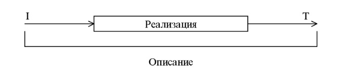
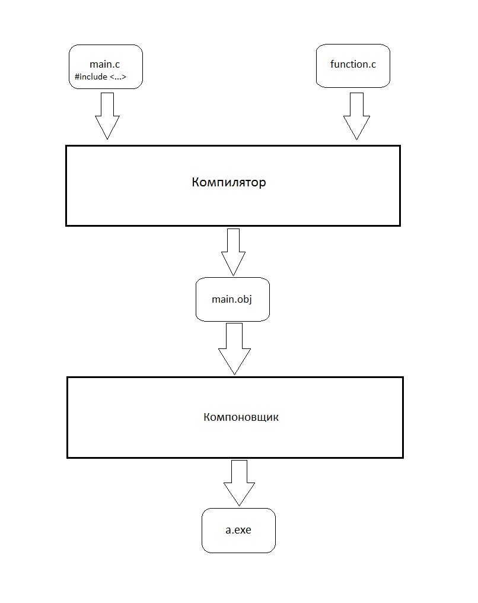
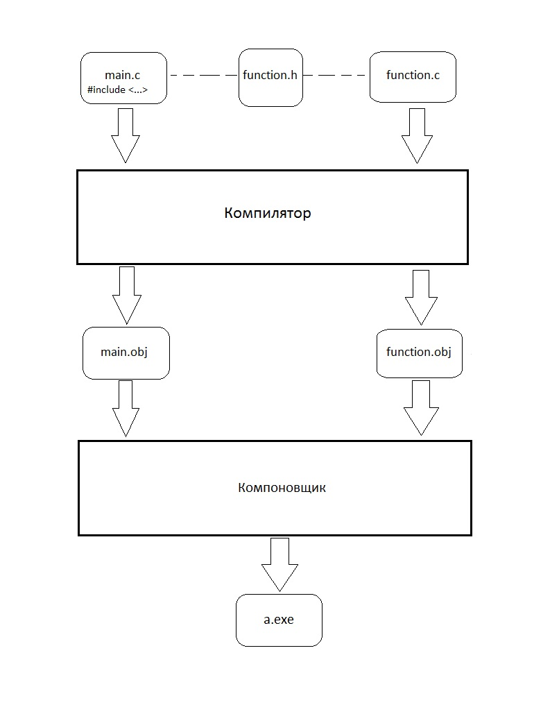
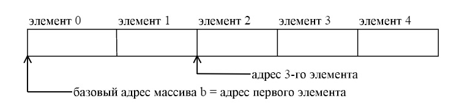
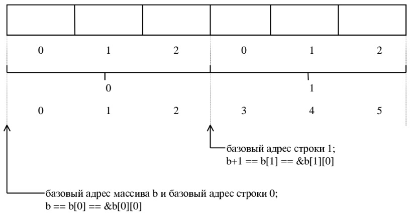
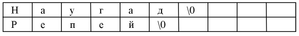
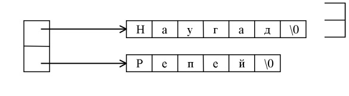

# Лекция 2

Темы, которые будут рассмотрены в этой лекции:
- Классы памяти;
- Размещение данных в оперативной памяти;
- Адрес переменной;
- Указатель;
- Функции в Си;
- Заголовочные файлы;
- Одномерныи и двумерные массивы.

## Классы памяти

Классом памяти переменной называется совокупность свойств, определяющая множество функций, которые могут иметь доступ к переменной, и время существования переменной.

В языке С выделяются пять классов памяти: автоматическая, регистровая, статическая, внешняя, внешняя статическая.

1. Автоматическая. Описывается ключевым словом auto.

Все переменные по умолчанию являются автоматическими. Они могут быть описаны только внутри некоторого блока.

Свойства:
- Переменные появляются только в момент входа в блок и их начальное значение не определено.
- Переменные исчезают в момент выхода из блока и присвоенное им значение теряется.
- Эти переменные доступны только внутри блока, где они описаны (другие блоки, в частности охватывающие, могут содержать переменные с теми же именами).

2. Регистровая. Описывается ключевым словом register.

Этот класс эквивалентен классу auto за тем исключением, что компилятор будет пытаться разместить переменную в регистре.

3. Статическая. Описывается ключевым словом static.

Переменные этого класса могут быть описаны как внутри так и вне блока.

Свойства:
- Переменные появляются в момент запуска программы, и исчезают в момент ее завершения. Начальное значение переменной устанавливается в 0.
- Если переменная описана внутри блока, то она известна только внутри этого блока. Если переменная описана вне блока, то она известна во всех функциях, следующих за описанием переменной, но на нее не могут ссылаться функции из других файлов.

4. Внешняя. Описывается ключевым словом extern.

Переменные этого класса могут быть описаны только вне блока и перед ними отсутствует ключевое слово static.

Свойства:
- Переменные появляются в момент запуска программы, и исчезают в момент ее завершения. Начальное значение переменной устанавливается в 0.
- Переменная известна во всех функциях, идущих после описания переменной. При этом на нее могут ссылаться функции из других единиц компиляции (файлов). Для этого в соответствующем файле данная переменная должна быть описана с ключевым словом extern.

5. Внешняя статическая. Описывается ключевым словом static.

Переменные этого класса могут быть описаны только вне блока и перед ними присутствует ключевое слово *static*.

Свойства:
- Переменные появляются в момент запуска программы, и исчезают в момент ее завершения. Начальное значение переменной устанавливается в 0.
- Переменная известна во всех функциях, идущих после описания переменной. При этом на нее не могут ссылаться функции из других единиц компиляции (файлов).
- Для функций доступны только два класса памяти — статический и внешний. Если функция описана с ключевым словом static, то она может вызываться только из файла где она описана, в противном случае она доступна из других файлов.


Описание переменной с указанием ее класса памяти имеет вид:

```C
класс_памяти тип_данных имя_переменной
```
Пример.
```c
auto int a;
static float b;
register j;
```


## Оперативная память

Оперативная память - часть компьютерной памяти, в которой во время работы компьютера хранится выполняемый машинный код (программы), а также входные, выходные и промежуточные данные, обрабатываемые процессором.

Схематично строение ОП можно представить в виде:

|Адрес памяти| Значение байта |
|------------|:--------------:|
|    00001   |     0000       |
|    00002   |     1939       |
|    .....   |     ....       |
|    32561   |     3123       |
|    32562   |     0000       |
|    32563   |     1532       |
|    32564   |     2911       |
|    .....   |     ....       |

Значения байтов взяты с потолка.

## Адрес переменной

Любая объявленная переменная при исполнении программы будет занимать какое-то определенное место в оперативной памяти.
Объявим переменную i и инициализируем ее значением 0:
```C
int i=0;
```
*Адресом* переменной называется адрес первого байта, который занимает переменная.

После встречи объявления переменной в программе операционная система выделяет под нее память. В общем случае, неизвестно, в каком адресе памяти будет храниться переменная. Пусть, например, ОС выделила под переменную *i* байты с адресами от 32561 до 32564 (т.к i имеет целый тип данных, под который выделяется 4 байта). В ОП это будет выглядеть так:

|Адрес памяти| Значение байта |
|------------|:--------------:|
|    .....   |     ....       |
|    32561   |     0000       |
|    32562   |     0000       |
|    32563   |     0000       |
|    32564   |     0000       |
|    .....   |     ....       |

Соответственно, адрес переменной i будет 32561.

## Операция получения адреса
В Си есть инструменты, позволяющие программисту получать адреса переменных и данных в целом.
Унарная операция & возвращает адрес переменной.
Пример:
```C
int i=0;
&i; // - здесь будет адрес переменной.
```
Адрес - это целое число, посему, его можно вывести на экран:
Пример:
```C
int main(){
  int i;
  printf("Адрес переменной i = %d\n",&i);
}
```

## Переменная-указатель
Получать адресс переменной - это, конечно, хорошо, но как-то маловато. Посему, есть еще *переменная-указатель*.

Значение переменной-указателя есть целое число, которое интерпретируется как адрес в оперативной памяти

Объявление переменной-указателя:
```C
int*   ptr;
char*  ptr2;
float* ptr3;
```
Сначала идет тип данных, которые хранятся по адресу этой переменной, потом ставится символ "\*", потом - имя переменной-указателя.

Применения указателей будет рассмотрено чуть позже.

## Операция раскрытия указателя

Адресов, переменных уже достаточно, но чего-то еще не хватает. Например, получения значения, которое хранится по адресу.

Для получения значения, которое хранится по адресу-значению указателя, используется унарная операция "\*" (не путать с объявлением указателя), которая ставится до названия переменной-указателя.

Пример:
```C
  int i=5;
  int* ptr;
  
  ptr=&i; //помещаем в указатель адрес переменной i
  printf ("*ptr = %d\n",*ptr); //выводим на экран значение, которое хранится по адресу, записанному в ptr; *ptr=5
```

Так как указатель, в общем-то, не зависит от типа данных, на которые он указывает, то есть возможность по-разному интерпретировать адреса в значении переменной-указателя:
```C
int i;
int* ptr;
ptr=&i;
printf("*(char* ptr)    = %c\n",*((char*)ptr));   //(char*)ptr - интерпретация ptr как указателя на char
                                          //*((char*)ptr) - получение значения char, которое хранится по адресу-значению указателя ptr
printf("*((char*)ptr+1) = %c\n",*((char*)ptr+1));  //смещение адреса на единицу дает адрес следующего байта
```
Правда, последствия подобной интерпретации остаются на совести программиста.

Смещение адреса (в примере выше это *ptr+1*) необходимо для получения значений из последующих\предыдущих адресов

Рассмотрим пример:
```C
int  i;
int* ptr;

ptr=&i; //пусть для примера &i будет равно 32565

printf("ptr   = %d\n",ptr); // Выводится значение-адрес ptr; ptr = 32565
printf("ptr+1 = %d\n",ptr+1); //Выводится значение адреса i + 4 байта вперед; ptr = 32569
printf("(int*)ptr+1 = %d\n",(int*)ptr+1); //Выведется то же, что и в предыдущей строчке
printf("(char*)ptr+1= %d\n",(char*)ptr+1); //Выводится значение адреса i + 1 байт вперед; ptr = 32566
```
Итак, при интерпретации ptr как указателя на целое смещение происходит на 4 байта вперед; при интерпретации ptr как указателя на символ смещение происходит на 1 байт вперед.
Рассмотрим следующее выражение:
```C

j=sizeof(/*type_name*/);
(/*type_name*/*)ptr + i;
```
Значение этого выражения - адрес, равный адресу ptr + i\*j байт, где j = количество байт, которые занимает имя типа данных *type_name* . i\*j и есть то, что мы назвали смещением. 

С операцией раскрытия указателя и его интерпретацией можно творить разные интересные штуки. Например, получить отдельно любой из четырех байт целого числа.
Пример такой программы:

```c
#include <stdio.h>

int main()
{

  int a16,a10,i;

  a16 = 0x01020304; //число 01020304 в шестнадцатеричной системе счисления
 
  for (i = 0; i < 4; i++)
  {
   printf("Byte %d: %02x\n", i, *((char*)&a16 + i)); //Интерпретация адреса (&a16+i) как адреса, в котором хранится char (1 байт).
  }                                                  //Cмещение в адресе от 0 до 4 (см. пример выше)
  printf("\n");

  a10=16909060; //число 16909060, равное числу 01020304 в шестнадцатеричной системе счисления
  // a10=a16;
  // printf("%d\n",a10);
  for (i = 0; i < 4; i++)
  {
   printf("Byte %d: %02d\n", i, *((char*)&a10 + i));
  }
}
```
Также необходимо отметить, что указатели можно сравнивать, вычитать, складывать - в общем, проводить над ними те же арифметические операции, что и над целыми числами.

Правильное понимание и использование указателей имеет большое значение при создании большинства С и С++-программ по четырем причинам:
- Указатели предоставляют способ, позволяющий функциям модифицировать передаваемые аргументы.
- Указатели используются для поддержки системы динамического выделения памяти.
- Использование указателей может повысить эффективность работы некоторых подпрограмм.
- Указатели, как правило, используются для поддержки некоторых структур данных типа связанные списки и двоичные деревья.

Помимо того, что указатели - одна из самых сильных сторон С, они, в то же время, могут нанести большой ущерб. Например, неинициализированный или дикий указатель может привести к краху системы; некорректное использование указателей приводит к трудноуловимым ошибкам.

Далее мы рассмотрим функции и использование в них указателей.

## Функции

Как известно, в практической деятельности решение любой сложной задачи требует, чтобы данная задача была разбита не ряд подзадач меньшей размерности и, затем, каждая из подзадач решается автономно.

Аналогично, при создании сложных программных систем рассматриваемая система разбивается на ряд подсистем, которые разрабатываются автономно.

В языке С элементарной программной подсистемой является функция. Функции подразделяют большие вычислительные задачи на более мелкие и позволяют воспользоваться тем, что уже сделано другими разработчиками. В выбранных должным образом функциях скрыты несущественные для других частей программы детали их функционирования, что делает программу в целом более ясной и облегчает внесение в нее изменений.

Обычно программы на языке С состоят из большого числа небольших функций, а не наоборот. Программу можно располагать в одном или нескольких исходных файлах. Эти файлы можно компилировать отдельно, а загружать вместе, в том числе и с ранее откомпилированными библиотечными функциями.

Функция — самостоятельная единица программы, спроектированная для реализации конкретной задачи. В языке С разрешается рекурсивный вызов функций. Связи по данным между функциями осуществляются через аппарат формальных параметров (аргументы),возвращаемые значения и внешние (глобальные) переменные.

Для определения функции в языке С необходимо:
1. Задать описание функции ("черный ящик").
2. Задать реализацию функции.



### Описание функций

Описание любой функции в языке С имеет следующий вид:

```C
 [тип_результата] имя_функции ([список_параметров]);
```

где

```C
список_параметров :: описание_параметра1, описание_параметра2, ...
описание_параметра :: тип_параметра имя_параметра.
```

При описании функции *тип_результата* может быть опущен. По умолчанию *тип_результата* является *int*.

Описание параметров похоже на описание переменных.

Примеры.
```C
long int fact( int n );
long int sqr( int a, int n );
double fsqr( float a, int n );
```
### Реализация функций

Определение реализации функции, в общем случае, имеет следующий вид:
```C
[тип_результата] имя_функции ([список_параметров]) 
{
  тело_функции
}

```
где *тело_функции* -совокупность операторов языка С.Возврат из функции и передача результата в вызывающую программную единицу осуществляется оператором return.

Общийвидоператора *return*:
```C
return [выражение];
```
Тип возвращаемого значения должен совпадать с типом результата функции.

Пример:
```C
/* Функция нахождения факториала числа */
int function ( int n ) 
{
  int fact,i;
  fact=1;
  for (i=1;i<=n;i++)
  {
    fact*=i;
  }
  return fact;
}
```
В исходном файле определения реализаций функций разрешается располагать в любом порядке. Кроме того, исходная программа может быть разбита на любое число файлов так, чтобы в различных файлах содержались реализации различных функций.

### Заголовочные файлы

В языке программирования Си заголовочные файлы — основной способ подключить к программе типы данных, структуры и пр., используемые в другом модуле. По умолчанию используется расширение .h .

В заголовочных файлах помещают описания функций (см. выше).

Заголовочный файл в общем случае может содержать любые конструкции языка программирования, но на практике исполняемый код в заголовочные файлы не помещают.

По сложившейся традиции, в заголовочных файлах объявляют функции стандартной библиотеки Си.

Также с помощью заголовочных файлах в Си осуществляются принципы раздельной компиляции.

Немного поговорим о компиляции программ, написанных на C.

Вообще, процесс трансляции (компиляции) происходит в два этапа:
- Перевод исходных файлов (.c) и команд на языке Си в объектные файлы (.obj или .o, например) и команды машинного языка. На этом этапе работае программа-компилятор.
- Сбор объектных файлов из разных модулей (.obj, lib) в единый исполняемый файл. На этом этапе программа-компоновщик (редактор связей, linker) связывает функции, переменные из разных модулей (например, формальные переменные в функции и фактические переменные в основной программе) в единый исполняемый файл. В общем случае, компоновщик работает с таблицами символов и имен объектных файлов, но это уже не относится к Си.

Теперь рассмотрим разницу при использовании заголовочного файла на примерах
#### Компиляция без использования заголовочного файла

Имеется один исходный файл main.c, в котором описаны функции, используемые в основной функции main:
```C
int example_function(...)
{
...
}


int main()
{
  ...
  example_function(...);
  ...
}
```
В таком случае на вход в программу компилятор поступает **один** исходный файл, на выходе получается **один** объектный файл. Линковщик делает исполняемый файл из одного объектного файла.

Если в файле main.с содержится большое число кода, то процесс компиляции может достигать 10-15 минут. Если вам необходимо поменять что-либо в функции *example_function*, не затрагивая функцию *main*, то вам в любом случае придется перекомпилировать **всю** программу, что долго.

Та же ситуация происходит, если вы реализуете ф-ию *example_function* в отдельном файле function.c, но включите его в main.c с помощью директивы препроцессора ```C #include```.

Файл function.c:
```C
int example_function(...)
{
  ...
}
```
Файл main.c:
```C
#include "function.c" //если два файла находятся в одной директории, то используются двойные кавычки вместо стрелочек
int main()
{
  ...
  example_function(...);
  ...
}
```
Вот, что произойдет при компиляции:




Опять-таки, невозможно изменить функцию *example_function* без перекомпилирования **всей** программы.

#### Компиляция с использованием заголовочного файла

Имеется исходный файл main.c с основной программой, в который включен заголовочный файл ```C function.h```:
```C
#include "function.h"
int main()
{
  ...
  example_function(...);
  ...
}
```
Имеется исходный файл function.c с реализацией ф-ии:
```C
int example_function(...)
{
  ...
}
```
Имеется заголовочный файл function.h с описанием ф-ии:
```C
int example_function(...);
```
Посмотрим, как происходит компиляция для такого вида компоновки исходных файлов:




В большинстве систем программирования есть возможность получить объектные файлы после программы-компилятора до получения исполняемого файла.

Таким образом, мы можем получить объектный файл main.o (напомню, файл с большим объемом кода), и еще раз компилировать main.c нам не нужно. Мы можем менять ф-ию *example_function* как пожелаем (главное, чтобы описание функции оставалось тем же), и подавать на компиляцию, чтобы получить ее объектный файл, а после отправить два объектных файла в компоновщик, дабы получить исполняемый файл.

Дешево и сердито.

Также, если отделять функции для работы с определенными данными, например, для работы с массивом, в отдельный файл и связывать его с исходным файлом основной программы через заголовочный файл, то будет **K P A C U B O** . Так, в общем-то, и реализованы стандартные библиотеки по типу ```C <stdio.h>``` - функции ввода-вывода, ```C <stdlib.h>``` - функции работы с памятью,```C <string.h>``` - функции работы со строками.

### Передача переменных в функцию.

В Си переменные в функцию передаются **по значению**.

Рассмотрим пример:

```C
#include <stdio.h>
int int_is_5 (int a) //пусть эта функция изменяет значение переменной, которую в  нее передает, на значение 5
{
  a = 5;
  return 0;
}

int main ()
{
  int i=0;
  
  int_is_5(i);  //пытаемся изменить значение переменной i
  printf("i = %d\n", i);

}
```

На выводе мы получаем следующее сообщение:

i = 0

Это значит, что значение i не изменилось.

Дело в том, что ф-ия int_is_5 приняла значение 0, которое никак не связано с переменной i. Для принятого 0 в области действия ф-ии выделяется память, которая **никак** не связана с переменной i из основной программы.

Чтобы иметь возможность изменять значение внутри ф-ии, нужно передавать в нее **указатель** на i. Тогда ф-ия примет значение указателя, т.е. адрес области памяти, где содержится переменная i из основной программы.

Модифицируем свою программу, чтобы все работало так, как задумано:

```C
#include <stdio.h>
int int_is_5 (int* a) //теперь в ф-ию поступает адрес переменной i из основной программы.
{
  *a = 5;  //заносим 5 в адрес область памяти, который хранится в переменной-указателе a.
  return 0;
}

int main ()
{
  int i=0;
  
  int_is_5(&i);  //в основной программе передаем в качестве фактического параметра адрес переменной i.
  printf("i = %d\n", i);

}
```
На выводе получаем следующее сообщение:

i = 5

Чего мы и хотели.

Если внутри ф-ии вам необходимо изменить значение переменной, которую вы передаете в ф-ию, то передать нужно указатель (&i, например).

Если внутри ф-ии нет необходимости изменять значение перемеенной, которую вы передаете в ф-ию, то нужно передать значение переменной ( i, например).


## Массивы

### Одномерный массив
Массив — это набор переменных, имеющих одно и то же базовое имя и отличающиеся одна от другой числовым признаком. Такие переменные называются элементами массива, а числовой признак — индексом элемента.

Описание массива имеет вид:
```C 
тип_элементов имя_массива[число_элементов]
```
Пример:
```C
float b[10];
int sup[56];
char buffer[81];
```
Все элементы массива пронумерованы, начиная с 0. Таким образом, индексы элементов пробегают значения от 0 до N-1, где N — число элементов в массиве. Для обращения к некоторому элементу массива используется следующая запись:
```C
имя_массива[индекс_элемента] 
```
где *индекс_элемента* — арифметическое выражение, результатом которого является целое число.
Значение выражения используется как номер элемента в массиве.Пример:
```C
int a[4];
.........
a[0] — первый элемент массива;
a[4-1] — последний элемент массива.
```
Как и обычные переменные, элементы массива могут находиться как слева от оператора присваивания, так и справа (свободно использоваться в арифметических выражениях).

Пример:
```C
float b[3];
.................
b[0] = b[1] + b[0] * b[1] / 2;
```
Элементы массива расположены в последовательных ячейках памяти, начиная с некоторого базового адреса.
```C
int b[5];
```


Для обозначения базового адреса массива используется имя массива без следующего за ним индекса. Имя массива без следующего за ним индекса является адресной константой, а не переменной.

Пример:
```C
int b[100];
int* ptr;

ptr = b; // базовый адрес массива b
```
Так же можно обращаться к элементом массива через указатель:
```C
int i, b[20];
.........
for (i=0;i<=20;i++)
{
  printf("b[%d] = %d\n",i,*(b+i)); // *(b+i) эквивалентно b[i]
}
```
### Многомерные массивы

Многомерным массивом языка С является массив элементы которого суть массивы.

Описание многомерного массива имеет вид:
```C
тип_данных имя_массива[размер_1][размер_2]...
```
Каждое целое число размер_i соответствует i-му измерению массива, а количество измерений массива называется его размерностью.

размер_1 можно рассматривать как количество элементов массива, а остальные размеры — как описание размерности массива-элемента.

Пример:
```C
int a[3][4]; // Матрица 3x4;
             // Массив из 3-х векторов, где каждый вектор имеет длину 4

int b[2][3][4]; // Массив из 2-х матриц 3x4;
                // Массив из двух элементов, каждый из которых является массивом
                // из трех векторов, где каждый вектор имеет длину 4
```
Для обращения к элементу массива используется запись вида:
```C
имя_массива[индекс_1][индекс_2]...
```

Число индексов при обращении к элементу массива должно совпадать с числом измерений массива, которое было указано при его описании.

#### Многомерные массивы и указатели


Многомерный массив занимает в памяти непрерывную область, и располагается так, что самый правый индекс меняется быстрее всех остальных (для матрицы это соответствует размещению по строкам).

Например, размещение двумерного массива ```C int b[2][3]``` может выглядеть следующим образом:



Можно использовать различные интерпретации такого массива.

Примеры:
```C
//Матрица 2x3.

for(i = 0; i<2; i++) {
  for(j = 0; j<3; j++) {
    printf("%d ", b[i][j]);
  }
  printf("\n");
}

////////////////////////////////////////////////////

// Одномерный массив из 6 элементов.
for(i = 0; i<6; i++) {
  printf("%d ", *((int *)b + i));
}

///////////////////////////////////////////////////

//Два одномерных массива, каждый по 3 элемента.

/* печать первой строки */
for(i = 0; i<3; i++) {
  printf("%d ", *(b[0] + i)); //т.к. элементом массива b являются массивы, то b[0] будет базовым адресом массива b[0][0-2]
}
printf("\n");
/* печать второй строки */
for(i = 0; i<3; i++) {
  printf("%d ", *(b[1] + i));
}
```

#### Передача массивов в качестве параметров функций

В языке С в функцию передается не сам массив, а его базовый адрес. Таким образом соответствующий формальный параметр должен быть описан в следующем виде:

тип_данных * имя_параметра

где тип_данных совпадает с типом элементов массива.

Альтернативным способом записи является следующий:

тип_данных имя_параметра[размер]

Операция [ ] является альтернативным способом записи операции *.

В силу того, что эти два описания эквивалентны, то размер массива не играет никакой роли и может быть опущен.

Для передачи многомерных массивов из описания формального параметра должен быть ясен размер массива-элемента, то есть пустые квадратные скобки могут быть указаны только для первого измерения.

Пример.
```C
int fun(int a[2][3]) {
  ...
}

// то же самое, что и
int fun(int a[][3]) {
  ...
}
```

#### Инициализация массивов

В языке С инициализировать можно только те массивы, которым приписан класс памяти static.

Пример. Инициализация одномерных массивов.
```C
static int jarr[5] = {10, 20, 30, 40, 50};
static int iarr[] = { 5, 10, 15, 20};
static char carr[] = {'B', 'E', 'A', 'T', 'L', 'E', 'S'};
static char sarr[5] = {'H', 'E', 'L', 'P', '!'};
```

Пример. Инициализация многомерных массивов.
```C
static int iarr[2][5] = {{10, 20, 30, 40, 50},
                          { 0, 5, 10, 15, 20}};

static int jarr[][4] = {{ 5, 10, 15, 20},
                        { 1, 2, 3, 4}};
```

#### Строки символов

Символьная строка в языке С — это массив символов, причем последний символ строки, но не обязательно последний элемент соответствующего массива, должен быть 0-символом '\0'.

Пример. Описание строки символов.
```C
char str[81];
```

Пример. Описание массива строк символов.
```C
char op_var[2][10]; // память выделена
char *ptrs[2]; // память не выделена
```
Пример. Инициализация массива строк символов.
```C
/* Два равносильных объявления */

a) static char op_var[2][10] = {{'Н','а','у','г','а','д','\0'},

{'Р','е','п','е','й','\0'}};

b) static char op_var[][10] = {{'Н','а','у','г','а','д','\0'},

{'Р','е','п','е','й','\0'}};
```


```C
/* Инициализация указателей */

a) static char * ptrs[2] = { "Наугад",

"Репей" };

b) static char * ptrs[] = { "Наугад",

"Репей" };
```


#### Основные функции работы со строками

Описания функций работы со строками содержаться в файле string.h.

В файле, где будут использоваться стандартные функции обработки строк дожна присутствовать директива препроцессора:
```C
#include <string.h>
```

Определение длины строки:
```C
int strlen(char * str);
```
Пример:
```C
//вариант a)
static char s[20] = {'T','h','e',' ','B','e','a','t','l','e','s','\0'};
...
printf("length = %d\n", strlen(s));


//вариант b)
char *ptrs = {"The Beatles"};
...
printf("length = %d\n", strlen(ptrs));
```

Копирование строк символов (присваивание):
```C
char * strcpy( char * dest, char * src);
```
В качестве результата возвращает dest.

Пример.
```
// вариант а)
char str[25];
...
strcpy(str, "Hello, Goodbye");

// вариант b) 
char * ptrs;
...
strcpy(ptrs, "Something"); /* Неправильно */

ptrs = "Something"; /* Правильно */

//вариант c)
char * ptrs;
char str[25];
...
ptrs = str;
strcpy(ptrs, "Something"); /* Правильно */
```

Копирование определенного количества символов:
```C
char * strncpy(char * dest, char * src, int len);
```

В качестве результата возвращает dest.

Пример.
```C
char str[25];

...
strncpy(str, "Hello, Goodbye", 5);
str[5] = '\0'; // Необходимо завершить строку 0-символом
```

Сравнение двух строк
```C
int strcmp(char * str1, char * str2);
```
Возвращаемые значения:
- < 0 — строка str1 лексикографически меньше строки str2;
- == 0 — строка str1совпадает по длине и содержанию со строкой str2;
- \> 0 — строка str1 лексикографически больше строки str2.

Пример:
```C
char * str1, * str2;

...
str1 = "Уголь ";
str2 = "Уголь";
strcmp(str1, str2); /* Результат > 0 */
```

Сравнение определенного количества символов двух строк
```C
int strncmp(char * str1, char * str2, int len);
```
Возвращаемые значения:
- < 0 — строка str1 лексикографически меньше строки str2;
- == 0 — строка str1совпадает по длине и содержанию со строкой str2;
- \> 0 — строка str1 лексикографически больше строки str2.

Пример:
```C
char * str1, * str2;
...
str1 = "Уголь ";
str2 = "Уголь";
strncmp(str1, str2, 5); /* Результат == 0 */
```

Сцепление двух строк
```C
char * strcat(char * dest, char * src);
```
Возвращает в качестве результата dest.

Пример:
```C
// вариант a) 
char str[20];
...
strcpy(str, "Led");
...
strcat(str, " Zeppelin");

// вариант b) 
char * str;
...
str = "Led";
...
strcat(str, " Zeppelin"); /* Неправильно */
```

Сцепление определенного количества символов
```C
char * strncat(char * dest, char * src, int len);
```
Возвращает в качестве результата dest.

Пример:
```C
char str[80];
char * temp = "A Day In The Life";
...
strcpy(str, "Oh, Happy");
...
strncat(str, temp+1, 3);
str[13] = '\0';
```

Заполнение определенного количества байт определенным значением
```C
void * memset(void * s, int c, int len);
```

В качестве результата возвращает s.

Пример:
```C
char str[80];
...
memset(str, '\0', 80);
```

#### Функции ввода-вывода строк

Функция ввода строки с экрана
```C
char * gets(char * str);
```
В качестве результата возвращает str.

Пример:
```C
// пример a) 
char str[80];
...
gets(str);

// пример b) 
char * str;
...
gets(str); /* Неправильно */
```
Замечание. При вводе символ '\n' заменяется на нуль-символ.

Функция вывода строки
```C
int puts(char * str);
```
Возвращает неотрицательное число в случае отсутствия ошибки вывода, иначе возвращает -1.

Пример:
```C
char * strt = "Help!";
...
puts(str);
```
