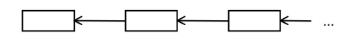

# Лекция 3

Темы, которые будут рассмотрены в этой лекции:

- Динамическое распределение памяти в программе;
- Пример использования динамического распределения памяти;
- Тип данных структура;
- Тип данных объединение;
- Использование структур и динамически выделенной памяти для реализации структур данных;
- Бинарное дерево.

## Динамическое распределение памяти

До этого мы работали с переменными (и памятью, выделяемую под нее), которые явно инициализировались в программе. Например, данная операция объявляет в программе массив из 81 символа:

```C
int a[81];
```
Объявляет в программе массив из 81 элемента. Но что делать, если количество элементов в массиве заранее неизвестно? Или, если обобщить: что делать, если заранее неизвестно, сколько памяти нужно выделить под переменные любого типа?

В языке Си существует механизм динамического распределения памяти, когда память выделяется во время выполнения программы по мере надобности.

Описание функций распределения памяти находятся в файлах *stdlib.h* или *alloc.h*.

### Функция malloc

Размещает блок памяти определенного размера в байтах.

Описание:

```C
void * malloc(int size);
//size — количество выделяемых байт памяти.
```

В качестве результата функция возвращает указатель на размещенный блок памяти размером size байт. Если блок такого размера разместить не удается, то функция возвращает значение NULL ( константа NULL описана в тех же файлах, в общем-то, равна нулю).

Пример.
```C
#include <stdlib.h>
int main()
{
  int * iptr;
  ...
  iptr = (int *)malloc(2);
  if(iptr == NULL) printf("No memory !\n");
  ...
}
```


### Функция calloc

Размещает блок памяти под определенное количество переменных определенного типа (динамический массив).

Описание:
```C
void * calloc(int nelem, int elsize);
/*
nelem - количество переменных;
elsize - размер в байтах элемента.
*/
```

Возвращает указатель на размещенный блок памяти размером nelem\*elsize байт. Если блок такого размера разместить не удается, то функция возвращает значение NULL.

После размещения выделенный блок памяти инициализируется значением 0.

Пример.
```C
#include <stdlib.h>
int main()
{
  int * iptr;
  int i;
  ...
  iptr = (int *)calloc(10, 2);
  if(iptr == NULL) 
    printf("No memory !\n");
  else
    for(i = 0; i<10; i++)
    {
      *(iptr+i) = i;
    }
  ...
}
```


### Функция освобождения динамически размещенной памяти

Функции malloc и calloc выделяют память из так называемой "кучи" (heap). Куча - это область памяти, из которой можно брать дополнительную память для размещения данных. 

Куча не бесконечна: как и любая память, она может закончиться.

Когда мы динамически выделяем память под нужды программы, мы "занимаем" у кучи на время использования адреса (байты) в памяти. Пока мы используем данную нам кучей память, никая другая программа не может использовать эти адреса. 

Если в нашей программе потребность в динамически выделенной памяти отпадает, мы должны ее "вернуть" обратно в кучу, иначе она останется ~~тяжелым грехом на нашей душе~~ занятой. Если гипотетически представить ситуацию, когда вся память из кучи будет занята, но возвращена обратно не будет, то программы не смогут себе выделить память динамически: ведь выделять уже будет нечего.

Кучу можно представить как банк, а вашу программу - как заёмщика. Когда заёмщику нужны деньги, он берет их у банка с обещанием вернуть в установленный срок (в нашем случае, установленный срок будет тогда, когда надобность в динамически выделенной памяти отпадет, например, в конце программы). Если заёмщик заберет все деньги у банка и ничего не вернет, то банк не сможет никому выдать денег, ведь у самого банка их и нет.

В общем случае, память, которую заняла ваша программа у кучи, будет возвращена обратно с помощью механизмов операционной системы. Однако, хороший стиль требует возвращать память во время исполнения программы (кто взял, тот и вернул).

Для возвращения памяти существует функция free:

```C
void free(void * block);
//block — указатель на ранее размещенный блок памяти с использованием функций malloc или calloc.
```

Пример.
```C
#include <stdlib.h>
int * iptr;
int i;
...
iptr = (int *)calloc(10, 2);
if(iptr == NULL) printf("No memory !\n");
else
for(i = 0; i<10; i++)
*(iptr+i) = i;
...
free(iptr);
...
```

### Пример использования функций динамического распределения памяти.

Давайте рассмотрим использование calloc на примере:

Вводится последовательность целых положительных чисел. Признаком конца последовательности является ввод числа, значение которого не больше 0. Напечатать введенные числа в обратном порядке.

Общая схема:




