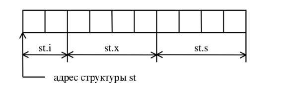
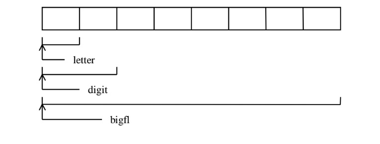

# Лекция 3

Темы, которые будут рассмотрены в этой лекции:

- Тип данных структура;
- Тип данных объединение;
- Динамическое распределение памяти;
- Пример использования динамического распределения памяти;
- Использование структур и динамически выделенной памяти для реализации структур данных. Стек, деревья и другие.

## Структура 

В языке C существует способ построения сложных типов данных путем объединения уже существующих типов в структуры. Описание структуры имеет вид:
```C
struct имя_типа_структуры 
{
  тип_данных имя_переменной;
  тип_данных имя_переменной;
  ...
};
```

Переменная, фугурирующая в описании типа структуры называется полем структуры (компонентой структуры). Такое описание вводит новый тип данных именуемый:
```C
struct имя_типа_структуры
```

Таким образом, впоследствии можно будет описывать переменные с введенным типом:
```C
struct имя_типа_структуры имя_переменной;
```

Примеры.
```C
struct records
{
  char group[20];
  char name[31];
  int min, sec;
};

int main()
{
  struct record a, b; // здесь определены переменные a и b типа struct record
  ...
}
```
Можно объединить описание структуры с описанием переменной:

```C
struct имя_типа_структуры 
{
...
} имя_переменной1, имя_переменной2, ...;
```
Если структура используется для описания только нескольких переменных в одном месте программы, то можно опустить имя_типа_структуры:
```C
struct 
{
...
} имя_переменной1, имя_переменной2, ...;
```

При этом описание переменных этого же типа в другом месте программы будет невозможно.

Переменную типа структуры можно рассматривать как объединение полей структуры, под одним именем. Значение переменной типа структуры распадается на значения входящих в нее полей. Для доступа к полю переменной используется следующая запись:
```C
имя_переменной_типа_структуры.имя_поля
```

Пример.
```C
struct disc
{
  char name; //поле структуры с именем name
  int year;
};

int main()
{
  struct disc d1, d2;
  strcpy(d1.name, "Help!");
  d1.year = 1965; //присваиваем полю year структуры d1 значения 1965.
  strcpy(d2.name, "White Album");
  d2.year = d1.year + 2;
};
```
Примечание: Иногда структуры называют неоднородными массивами (в отличие от обычных массивов, которые являются однородными).

### Присваивание структур

Переменные типа структур можно присваивать друг другу если они относятся к одному и тому же типу.

Пример.
```C
struct records 
{
  char group[30];
  char name[80];
  int min, sec;
};

int main() {
  struct b1, b2;
  strcpy( b1.group, "Pink Floyd" );
  strcpy( b1.name, "The Dark Side Of The Moon");
  b1.min = 43;
  b1.sec = 49;
  b2 = b1;
}
```
При таком присваивании все поля одной структуры будут скопированы в поля другой структуры.

### Указатели на структуры

Структура располагается в памяти в последовательных ячейках. Размер памяти занимаемый структурой является суммой размеров входящих в нее полей (возможно с учетом выравнивания некоторых [на границу слова](https://ru.wikipedia.org/wiki/Выравнивание_данных)).

Пример.

```C
struct 
{
  int i;
  float x;
  char s[ 4 ];
} st;
```


Описание указателя на структуру имеет вид:\
```C
struct имя_типа_структуры * имя_переменной;
```

Если p — указатель на структуру, то ссылка на поле структуры имеет вид:

```C
p -> имя_поля
```

### Передача структур в качестве параметра

Передача структур в качестве параметров функций обычно происходит через указатели на структуры.

Пример.

```C
struct xcoord 
{
  int x, y;
  char attr, color;
};


void fun( struct xcoord * st ) { //передаем в функцию указатель st на структуру xcoord 
  struct xccord st1, st2;
  
  st->x = 12; //обращению к полю x структуры xcoord через указатель st
  st->y = 10;
  st->attr = 'A';
  st->color = 0;
  st1 = *st;
  st2.x = st->x;
  ...
}
```

### Вложенные структуры

В качестве полей структур могут быть использованы другие структуры (такие структуры называются вложенными). Такие структуры должны быть определены до содержащей их структуры.

Пример.
```C
struct time 
{
  int min, sec;
};

struct records 
{
  struct time t; //вложенная структура time
  char group[20];
  char name[80];
};

int main()
{
  struct records;

  d.t.min = 43;
  d.t.sec = 10;
  strcpy(d.group, "Deep Purple");
  strcpy(d.name, "Fireball");
  ...
}
```
### Массивы структур

Описание массива структур аналогично описанию массива любого другого типа.

Обработка элементов массива структур производится аналогично обработке элементов массива любого другого типа.

Пример.

```C
struct records audio[30];

int i;

for(i=0; i<30; i++) 
{
  gets(audio[i].group);
  gets(audio[i].name);
  scanf("%d %d", &(audio[i].min), &(audio[i].sec));
}
...
```

### Объединения

Объединение - это средство, позволяющее запоминать данные различных типов в одном и том же месте памяти.

Объединения описываются так же, как и структуры, за исключением того, что вместо ключевого слова *struct* используется ключевое слово *union*.

Доступ к полям объединения осуществляется аналогично доступу к полям структуры.

Пример.
```C
union ttt 
{
  int digit;
  double bigfl;
  char letter;
};

...
unit ttt types;
...
types.digit = 25;
types.bigfl = 2.0;
types.letter = 'S';
...
```

Схема распределения памяти:



Использование объединений помогает создавать машинно-независимый (переносимый) код. Поскольку компилятор отслеживает настоящие размеры переменных, образующих объединение, уменьшается зависимость от компьютера. Не нужно беспокоиться о размере целых или вещественных чисел, символов или чего-либо еще.

Объединения часто используются при необходимости преобразования типов, поскольку можно обращаться к данным, хранящимся в объединении, совершенно различными способами.


## Динамическое распределение памяти

До этого мы работали с переменными (и памятью, выделяемую под нее), которые явно инициализировались в программе. Например, данная операция объявляет в программе массив из 81 символа:

```C
int a[81];
```
Объявляет в программе массив из 81 элемента. Но что делать, если количество элементов в массиве заранее неизвестно? Или, если обобщить: что делать, если заранее неизвестно, сколько памяти нужно выделить под переменные любого типа?

В языке Си существует механизм динамического распределения памяти, когда память выделяется во время выполнения программы по мере надобности.

Описание функций распределения памяти находятся в файлах *stdlib.h* или *alloc.h*.

### Функция malloc

Размещает блок памяти определенного размера в байтах.

Описание:

```C
void * malloc(int size);
//size — количество выделяемых байт памяти.
```

В качестве результата функция возвращает указатель на размещенный блок памяти размером size байт. Если блок такого размера разместить не удается, то функция возвращает значение NULL ( константа NULL описана в тех же файлах, в общем-то, равна нулю).

Пример.
```C
#include <stdlib.h>
int main()
{
  int * iptr;
  ...
  iptr = (int *)malloc(2);
  if(iptr == NULL) printf("No memory !\n");
  ...
}
```


### Функция calloc

Размещает блок памяти под определенное количество переменных определенного типа (динамический массив).

Описание:
```C
void * calloc(int nelem, int elsize);
/*
nelem - количество переменных;
elsize - размер в байтах элемента.
*/
```

Возвращает указатель на размещенный блок памяти размером nelem\*elsize байт. Если блок такого размера разместить не удается, то функция возвращает значение NULL.

После размещения выделенный блок памяти инициализируется значением 0.

Пример.
```C
#include <stdlib.h>
int main()
{
  int * iptr;
  int i;
  ...
  iptr = (int *)calloc(10, 2);
  if(iptr == NULL) 
    printf("No memory !\n");
  else
    for(i = 0; i<10; i++)
    {
      *(iptr+i) = i;
    }
  ...
}
```


### Функция освобождения динамически размещенной памяти

Функции malloc и calloc выделяют память из так называемой "кучи" (heap). Куча - это область памяти, из которой можно брать дополнительную память для размещения данных. 

Куча не бесконечна: как и любая память, она может закончиться.

Когда мы динамически выделяем память под нужды программы, мы "занимаем" у кучи на время использования адреса (байты) в памяти. Пока мы используем данную нам кучей память, никая другая программа не может использовать эти адреса. 

Если в нашей программе потребность в динамически выделенной памяти отпадает, мы должны ее "вернуть" обратно в кучу, иначе она останется ~~тяжелым грехом на нашей душе~~ занятой. Если гипотетически представить ситуацию, когда вся память из кучи будет занята, но возвращена обратно не будет, то программы не смогут себе выделить память динамически: ведь выделять уже будет нечего.

Кучу можно представить как банк, а вашу программу - как заёмщика. Когда заёмщику нужны деньги, он берет их у банка с обещанием вернуть в установленный срок (в нашем случае, установленный срок будет тогда, когда надобность в динамически выделенной памяти отпадет, например, в конце программы). Если заёмщик заберет все деньги у банка и ничего не вернет, то банк не сможет никому выдать денег, ведь у самого банка их и нет.

В общем случае, память, которую заняла ваша программа у кучи, будет возвращена обратно с помощью механизмов операционной системы. Однако, хороший стиль требует возвращать память во время исполнения программы (кто взял, тот и вернул).

Для возвращения памяти существует функция free:

```C
void free(void * block);
//block — указатель на ранее размещенный блок памяти с использованием функций malloc или calloc.
```

Пример.
```C
#include <stdlib.h>
int * iptr;
int i;
...
iptr = (int *)calloc(10, 2);
if(iptr == NULL) printf("No memory !\n");
else
for(i = 0; i<10; i++)
*(iptr+i) = i;
...
free(iptr);
...
```

### Пример использования функций динамического распределения памяти.

Давайте рассмотрим использование calloc на примере:

Вводится последовательность целых положительных чисел. Признаком конца последовательности является ввод числа, значение которого не больше 0. Напечатать введенные числа в обратном порядке.

Общая схема:


